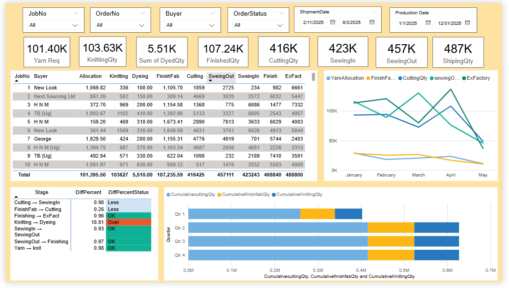
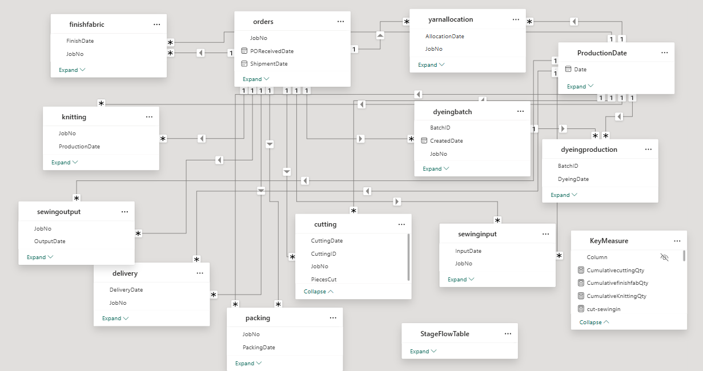

# 🧵 Garments Production Dashboard – Power BI

A comprehensive Power BI dashboard that visualizes the end-to-end **garment production flow** — from yarn allocation to ex-factory delivery. This dashboard is built to help production and planning teams monitor stage-wise progress, identify bottlenecks, and analyze performance using a date-driven ETL model.

---

## 📌 Objective

This project aims to:
- Centralize multiple production stage datasets into a unified, interactive report.
- Provide real-time insights into daily production status by Job, Buyer, and Order.
- Highlight delays and bottlenecks between stages to support faster decision-making.
- Allow filtering and drilling down using shipment and production dates.

---

## 📊 Key Features

- **Unified KPI cards**: Real-time totals for each stage (e.g., CuttingQty, SewingOut, ShippingQty).
- **Dynamic slicers**: Filter by Job No, Buyer, Order Status, Shipment Date, and Production Date.
- **Trend Analysis Line Chart**: Monthly performance of key production quantities.
- **Cumulative Comparison Bar Chart**: Quarter-wise comparison of knitting, finishing, and cutting outputs.
- **Stage-wise Bottleneck Table**:
  - Automatically calculates percentage drop between stages.
  - Flags status as ✅ OK, 🟠 Delay, or 🔴 Bottleneck.
- **Detailed Job Matrix**: Job-level view of quantities across all stages with totals.

---
## 🧩 Data Model Architecture

---

## 🧠 Insights Enabled

- Which production stages are underperforming over time?
- Are there any bottlenecks between stages based on quantity or date delay?
- How is production progressing by quarter, month, buyer, or order?
- Where is the highest drop-off in production occurring?
