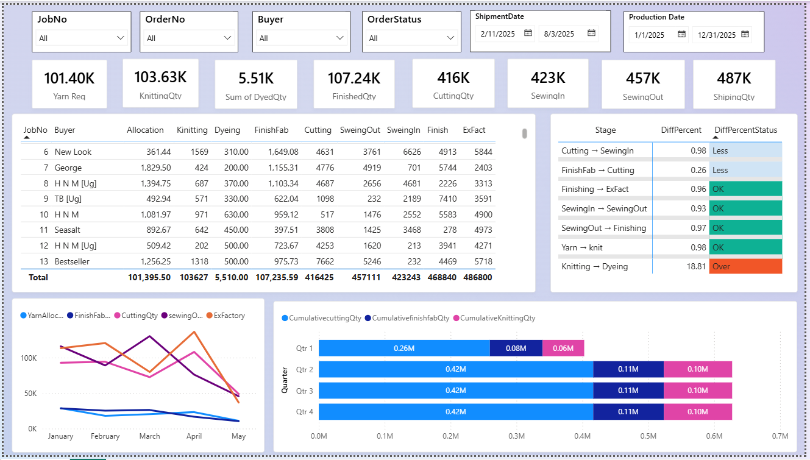
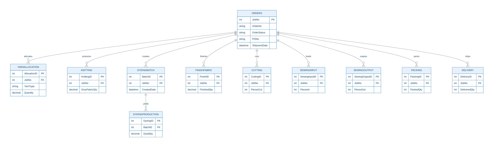
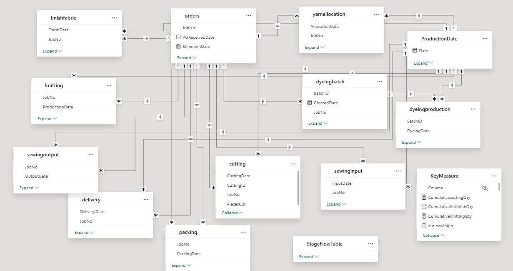
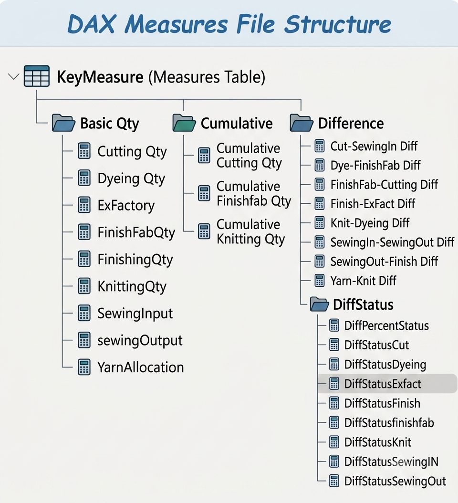
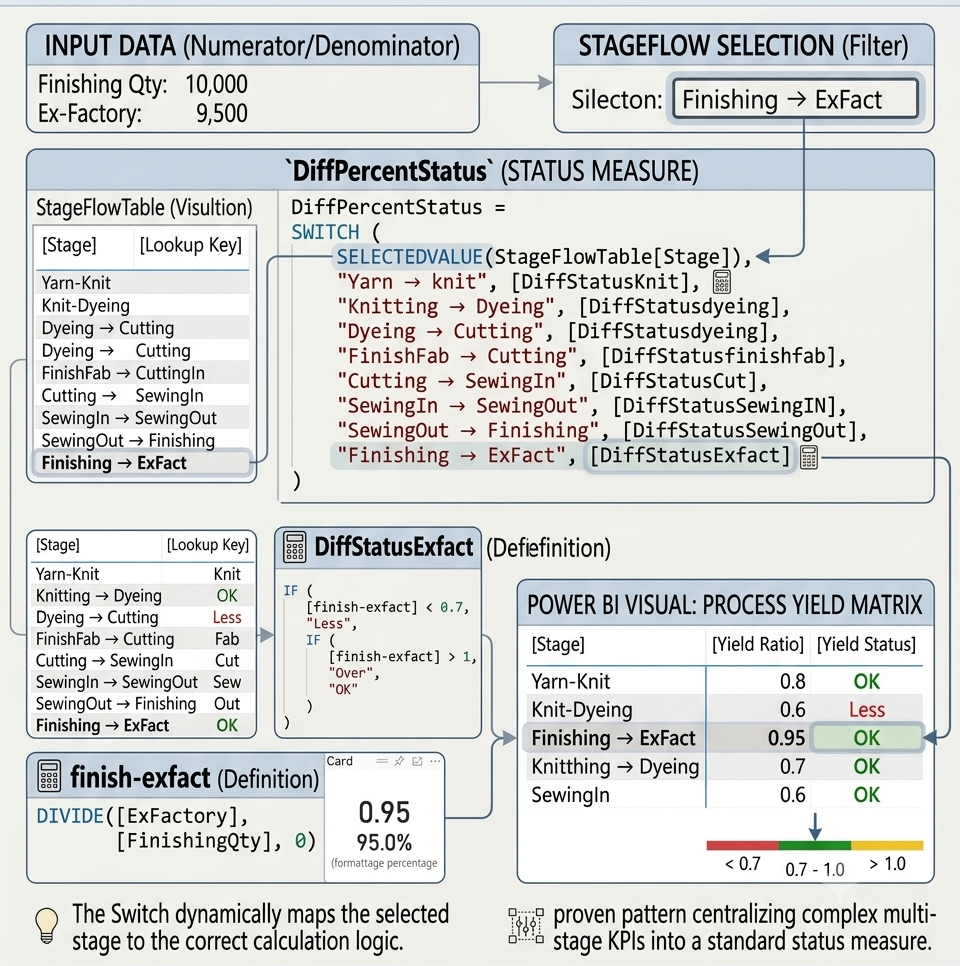

# Garments Production Dashboard (Power BI)

A production tracking dashboard for garment manufacturing, built on top of a relational ERP schema I designed from scratch. It follows a single job order through every stage — yarn allocation, knitting, dyeing, finishing, cutting, sewing, packing, and delivery — and surfaces exactly where things are slowing down before it becomes a shipping problem.

I built this because most factory dashboards I've come across just report totals per stage. They don't tell you *where* the process is leaking. This one does.



---

## Why this exists

In garment production, a small delay at one stage rarely stays small. A slow cutting run doesn't show up as a problem until sewing output starts falling behind, and by the time it hits shipping, there's no time left to fix it. Most planning teams find out after the fact — from a missed shipment date, not from the data.

This project started as a question: could I model the entire production chain in a proper relational database, then build a dashboard on top that flags a bottleneck the moment it starts forming, instead of after it compounds?

## What it does

- Pulls every production stage into one connected model instead of scattered spreadsheets
- Shows real-time totals by Job No, Buyer, and Order Status
- Flags each stage as OK, Delay, or Bottleneck based on the percentage drop-off compared to the stage before it
- Lets you drill into a single job, buyer, or shipment date and see the full stage-by-stage trail
- Breaks down monthly and quarterly trends for knitting, finishing, and cutting output

## Key features

**KPI cards** — running totals for each stage (CuttingQty, SewingOut, ShippingQty, etc.), updated as new production records come in.

**Slicers** — filter the whole report by Job No, Buyer, Order Status, Shipment Date, or Production Date.

**Trend line chart** — monthly view of production quantities across stages, so you can spot a slowdown before it becomes a pattern.

**Quarter-wise comparison chart** — knitting, finishing, and cutting output side by side, quarter over quarter.

**Bottleneck table** — this is the core of the project. For each stage, it calculates the percentage quantity drop from the previous stage and flags it:
- ✅ OK — within expected variance
- 🟠 Delay — drop-off is higher than normal but not critical
- 🔴 Bottleneck — significant loss between stages, needs attention

**Job matrix** — a full job-level breakdown showing quantities across every stage, with totals, so you can trace one order end to end.

---

## The data model

I designed the schema myself rather than working off an existing template. `Orders` is the hub table (keyed on `JobNo`), and every production stage is a child table that references it.

**Database structure (MySQL):**



**Power BI data model view:**



One deliberate design decision worth calling out: dyeing isn't a flat one-to-many like the other stages. It's modeled as **DyeingBatch → DyeingProduction**, because a single job can be split across multiple dye lots, and each batch can go through more than one dyeing run before it's finished. Flattening that into a single table would've lost real information — a job's dyed quantity isn't always one clean number, it's the sum of however many batches and runs it took to get there. Every other stage (cutting, sewing input/output, packing, delivery) is a straightforward one-to-many off `Orders`, since those genuinely are single events per job.

## The DAX layer

The bottleneck detection isn't hardcoded per stage — it's one dynamic measure that reads which stage transition is selected and computes the right ratio for it.

**Measures are organized into four folders**, so the logic stays traceable instead of turning into thirty unlabeled formulas:



- **Basic Qty** — raw quantities per stage (CuttingQty, DyeingQty, KnittingQty, etc.)
- **Cumulative** — running totals where the analysis needs them
- **Difference** — one ratio measure per stage transition (e.g. `finish-exfact = DIVIDE([ExFactory], [FinishingQty], 0)`)
- **DiffStatus** — one status measure per transition, classifying the ratio as Less / OK / Over against fixed thresholds

**How it comes together:**



A `StageFlowTable` holds the list of stage transitions. Whichever one the user selects, `DiffPercentStatus` uses `SELECTEDVALUE` in a `SWITCH` to route to that transition's specific status measure — so the report has one dynamic status column instead of eight separate hardcoded ones. Underneath, each status measure applies the same threshold logic:

```dax
DiffStatusExfact =
IF (
    [finish-exfact] < 0.7, "Less",
    IF ( [finish-exfact] > 1, "Over", "OK" )
)
```

A ratio below 0.7 means output is falling well short of input — a real bottleneck. Above 1.0 usually means backlog clearing or a timing overlap between stages. Anything in between is healthy.

## What this shows about how I work

- I model data before I build reports on top of it — the dashboard is only as good as the schema underneath, and I treated this like a real ERP design problem, not just a BI exercise
- I look for where a domain has real structural nuance (the dyeing batch/run relationship) instead of flattening everything for convenience
- I build for the decision someone needs to make (where's the bottleneck?) rather than just displaying numbers

## Questions this dashboard can answer

- Which stage is underperforming, and since when?
- Is a specific job or buyer's order falling behind, and where exactly?
- How does this quarter's output compare to last quarter, by stage?
- Where is the biggest drop-off happening across the whole pipeline?

---

Built in Power BI, with the data model and ETL logic designed around a MySQL schema (`Orders` + 10 related stage tables). Screenshots above are from the live report.